# twbh2
MVC MODEL2로 구현한 JSP/Servlet 커뮤니티(확장판)  
The Way BACK Home은 직장인을 위한 커뮤니티 입니다.  
**★ 움직이는 이미지가 있어 크롬 브라우저로 봐주시면 감사하겠습니다.**
***


TWBH 구현 기능
-------------
-  로그인, 회원가입, 회원 정보 수정, 회원 탈퇴
-  게시글 입력,수정,삭제
-  페이징 처리
-  글 입력시 사진 업로드
-  답변글 달기
-  댓글 입력
-  좋아요 구현(Jquery Ajax 사용)
-  기상청 open API로 부터 날씨를 받아오는 기능

개발 환경 및 기술
-------------
- eclipse
- apache-tomcat-8.0.46
- oracle 11g:xe
- jsp/servlet 
- javaScript
- EL / JSTL
- w3.css
- jquery
- Ajax
- Open API JSON Parsing

WEB-INF/lib 추가
-------------
-  cos.jar  //사진 업로드를 위한 라이브러리
-  jstl.jar //jstl
-  standard.jar //EL
-  ojdbc.jar  //oracle db
-  json-simple-2.1.2.jar // ajax json 방식으로 통신하기 위함

server.xml 데이터베이스 커넥션 풀 추가 내용
-------------
```html
 <Context docBase="TWBH" path="/TWBH" reloadable="true" source="org.eclipse.jst.jee.server:TWBH">
         <Resource auth="Container" driverClassName="oracle.jdbc.driver.OracleDriver" loginTimeout="10" maxActive="50" maxIdle="20" 
         maxWait="5000" name="jdbc/myoracle" username="아이디" password="패스워드" testOnBorrow="true" type="javax.sql.DataSource"
         url="jdbc:oracle:thin:@127.0.0.1:1521:XE" />
      </Context>
```


회원 table db 쿼리문
-------------
<pre><code>
create table member(
  name varchar2(30) ,
  userid varchar2(30) primary key,
  pwd varchar2(30) not null,
  email varchar2(30),
  phone varchar2(30),
  admin number(1) default 1
);
</code></pre>


게시판 table db 쿼리문
-------------
<pre><code>
create table board(
  num number(5) primary key,
  name varchar2(30),
  email varchar2(30),
  title varchar2(100),
  content varchar2(1000),
  readcount number(4) default 0,
  img varchar2(100),
  ref number(5) default 0,
  indent number(5) default 0,
  step number(5) default 0,
  writedate DATE DEFAULT sysdate,
  comment_count number(10) default 0,
  like_it number(10) default 0,
  CONSTRAINT fk_name FOREIGN KEY(name) REFERENCES member(userid) on delete cascade   //on delete cascade 회원탈퇴시 관련 게시글 모두 삭제
);

create sequence board_seq  start with 1 increment by 1;
</code></pre>


댓글 table db 쿼리문
-------------
<pre><code>
create table board_comment(
  comment_num number(5) primary key,
  board_num number(5),
  userid varchar2(30),
  content varchar2(600),
  writedate DATE DEFAULT sysdate,
  CONSTRAINT FK_comment FOREIGN KEY(board_num) REFERENCES board(num),
  CONSTRAINT FK_name2 FOREIGN KEY(userid) REFERENCES member(userid)
);

create sequence comment_seq start with 1 increment by 1;
</code></pre>

날씨 table db 쿼리문
-------------
weather_loc 테이블은 기상청에서 주어지는 
'동네예보조회서비스_격자_위경도_20190107.xlsx' 파일을 직접 import하여 테이블 만듦  

***
구현 화면
-------------

**<전체적인 구조>**  
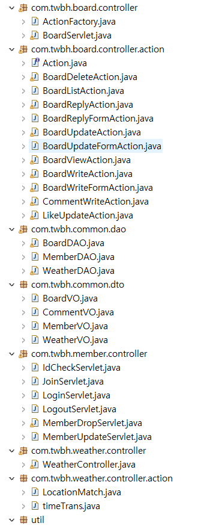  
-  com.twbh.board.controller  : (게시판 관련) 1개의 서블릿(BoardServlet)이 커맨드를 받아 ActionFactory에 보낸다.
-  com.twbh.board.controller.action : controller로부터 받은 커맨드들을 각 커맨드에 맞게 클래스에서 수행한다. 
  각 클래스들은 인터페이스인 Action을 구현한다.
-  com.twbh.common.dao : DAO 데이터베이스 관련 작업을 수행
-  com.twbh.common.dto : DB에서 넣거나 가져온 데이터를 담아두는 역할 
-  com.twbh.member.controller : (회원관리 관련) 컨트롤러
-  com.twbh.weather.controller : 날씨 요청을 받으면 처리하는 컨트롤러
-  com.twbh.weather.controller.action : 기상청 api에게 데이터를 요청하기 위해서 그에 맞는 형식으로 날짜,시간,장소로 바꿔주는 역할  
-  util : DB 커넥션, 클로즈 

  
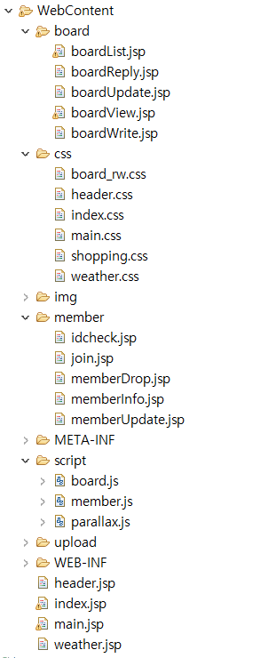  
-  index.jsp : 첫 시작 화면, 로그인form
-  main.jsp : 로그인을 성공하면 보여지는 메인 페이지
-  weather.jsp : 날씨 페이지
-  header.jsp : 모든 페이지의 헤더  
-  /board/ : 게시판 관련 jsp 모아놓은 폴더
-  /css/  : 게시판과 회원관리 관련 css 폴더
-  /img/  : jsp에 사용된 로고,사진들 저장해놓은 폴더
-  /upload/ : 사용자로부터 입력 받은 사진들 저장해놓은 폴더
-  /member/  :  회원관리 관련 jsp들모아놓은 폴더
-  /script/  : ajax, 유효성 검사를 위한 자바스크립트들을 모아놓은 폴더
  

**<index.jsp>**  
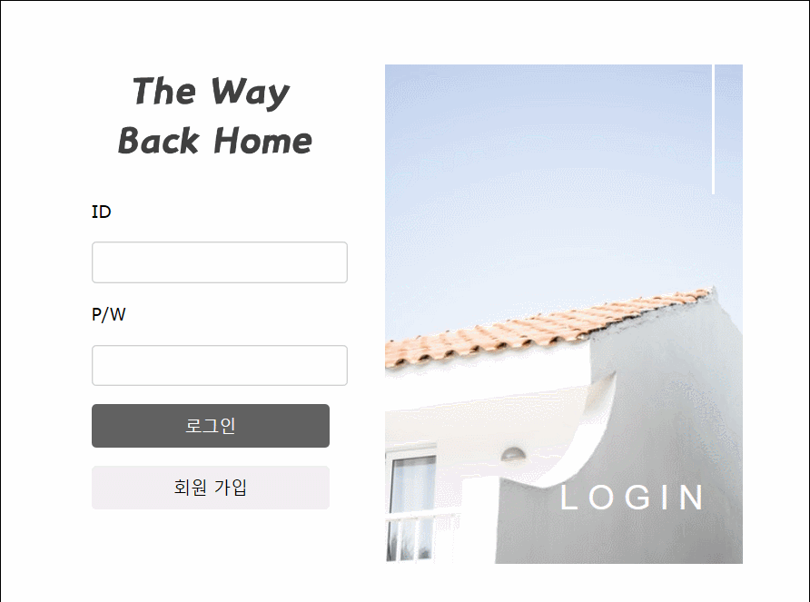  
- jquery를 이용해 이미지 위에 마우스가 올라가면 움직이는 효과를 줌.

  
**<회원가입>**   
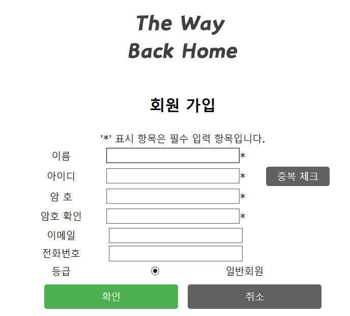  
  

**<회원가입_아이디중복확인>**   
  
- java script(member.js) 이용하여 유효성검사를 실시 
  
  
**<회원가입_유효성검사>**  
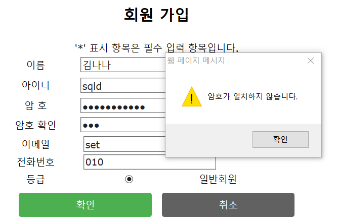  
- java script(member.js) 이용하여 유효성검사를 실시  
  
**<메인 페이지>**  
  
- 로그인을 하고 나면 들어오게 되는 메인페이지
- parallaxScrolling 기법을 이용하여 CSS를 꾸밈 (내가 제일 좋아하는 기법)  
  
**<게시판 리스트>**  
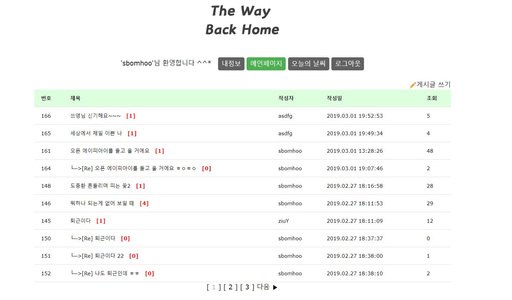  
-  게시글 제목 옆에 주황색 대괄호로 게시글의 댓글 갯수를 나타나게 구현  
> 페이징 처리
> -  한 페이지당보여줄 글 갯수 =10;
> -  현재 페이지 = 기본값 1로 설정하고, 파라미터로 page값 넘어오면 알맞게 수정  
> -  전체 게시글 갯수 = dao를 통해 받아옴
> -  전체 페이지 갯수 = (전체 게시글 개수-1)/페이지당 글 수 +1  
> -  페이지 그룹화 = 3  (3개의 페이지가 한 묶음, 3개를 넘어가면 다음이라는 글자가 뜨도록 구현)  
>      ex> [1][2][3]다음 이전[4][5][6]다음  이전[7][8][9]다음 
>      
> -  시작페이지 = ((현재페이지-1)/그룹당 보여줄 페이지)x페이지 그룹화+1   ex> [1] [4] [7]
> -  끝페이지 =  시작페이지+그룹당 보여줄 페이지-1   ex> [3] [6] [9]

**<내 정보>**  
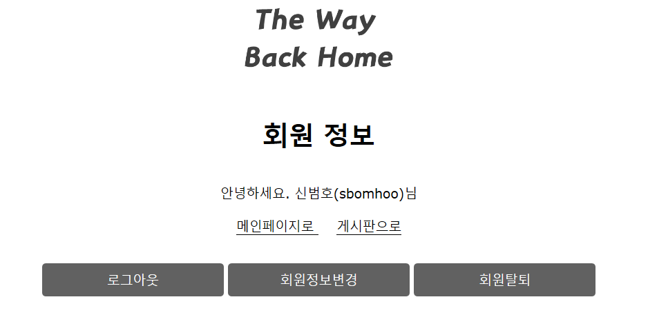  

  
**<회원정보수정>**  
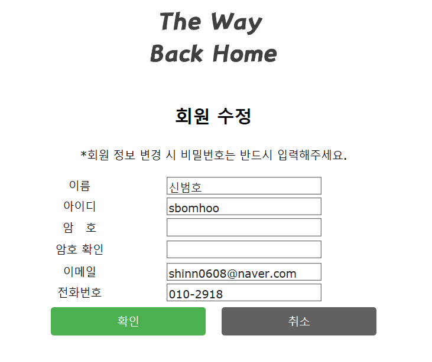  
  
  
**<회원 탈퇴>**  
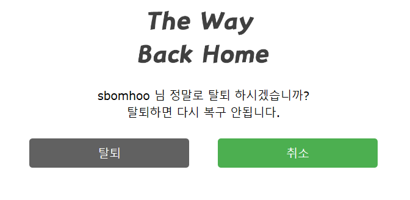  
  

**<글 쓰기>**  
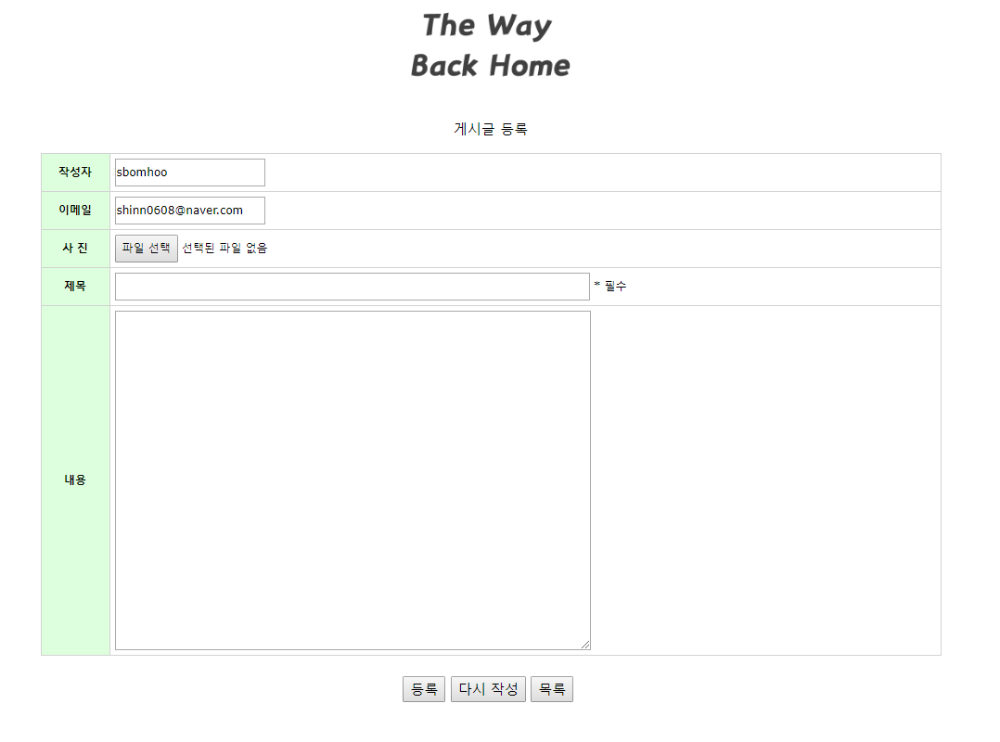  
-  글 입력시 multipartRequest를 사용하여 이미지도 같이 업로드 할 수 있게 구현
-  이미지는 img폴더안에 저장이 되고 DB에는 이미지명과 확장자를 저장해둔다.
-  게시글을 쓰기 위해서는 request 값을 두번 받아야하는데(커맨드와 폼입력값) 
-  multipartRequest를 사용하니 값을 두번 가져올 수가 없어서 session을 통해 커맨드 값을 보내주어 문제 해결 
  

**<내가 쓴 글 보기>**  
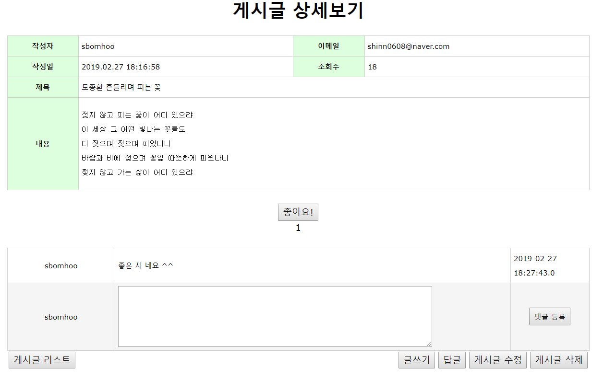  
-  댓글 기능 구현
-  JSTL과 EL을 사용하여 자기가 쓴 글만 수정,삭제 버튼이 보이도록 구현
  

**<남이 쓴 글 보기>**  
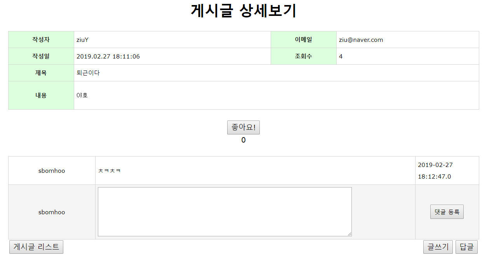  
-  남이 쓴 글에는 수정,삭제 버튼이 나타나지 않음
  
    
**<좋아요 클릭>**  
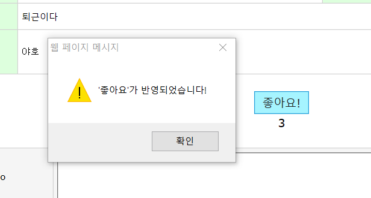  
  
    
**<좋아요 update>**  
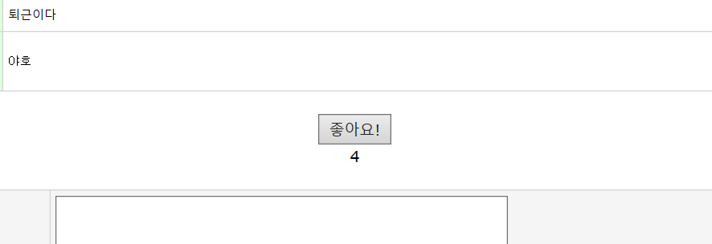  
-  ajax를 이용하여 페이지 이동 없이 좋아요를 누를 수 있도록 구현
-  좋아요를 누르면 board.js의 like함수를 호출해 ajax.serialize()를 이용하여 서버단으로 데이터를 보냄
-  서버단에서 DB에 좋아요 값을 update하고 성공시 alert창을 띄어 사용자에게 알리고   
-  view단에 아이디 값인 like_result div의 값을 수정된 값으로 변경  


**<답글 쓰기1>**
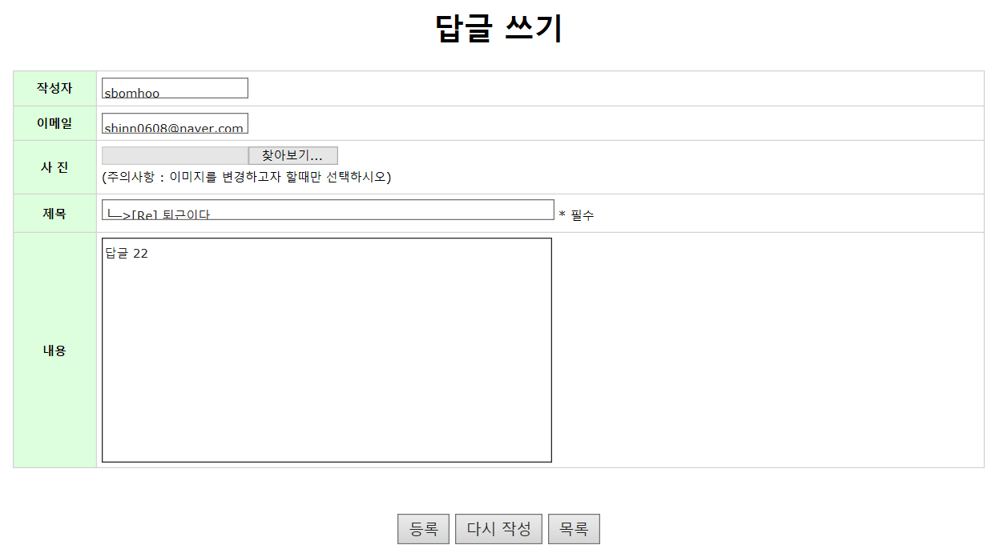  
  

**<답글 쓰기2>**  
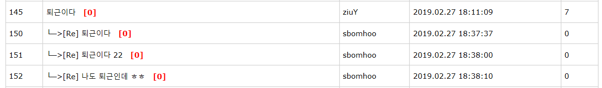  
- 답글 저장시 db에서 부모의 글번호를 ref로 저장하고 요청된 ref와 같은 데이터의 step을 1씩 증가 시킴  
- 게시판 list에서 불러올 때 ref를 내림차순 기준으로 정렬을 하고 만약 ref가 같으면 step을 오름차순 기준으로 정렬함  
  
  
**<게시글 삭제>**  
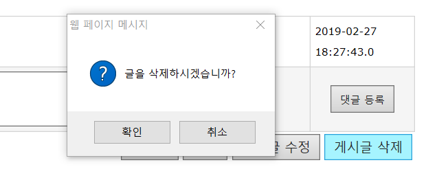  
  
   
**<게시글 수정 Form>**  
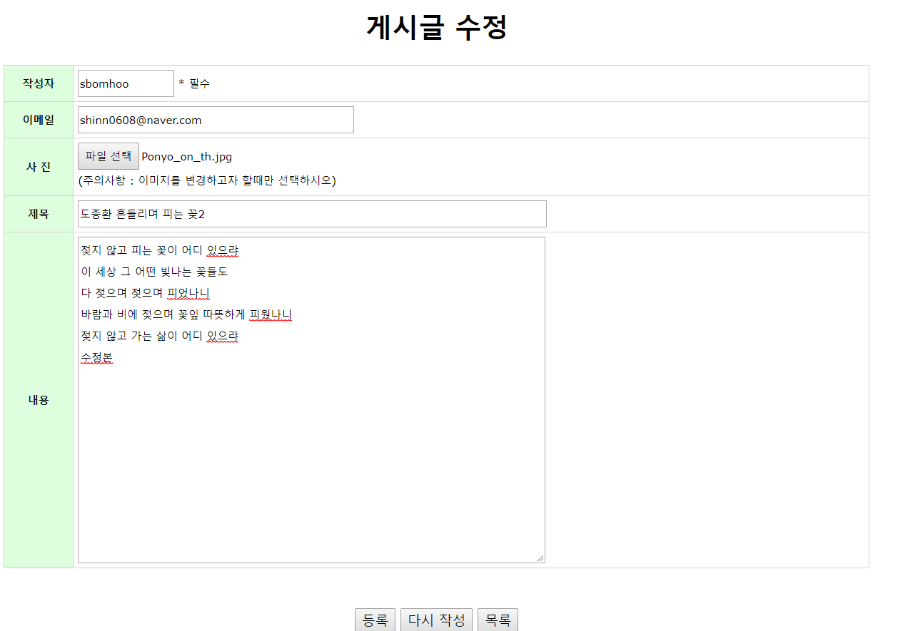  
  
  
**<게시글 수정 후>**  
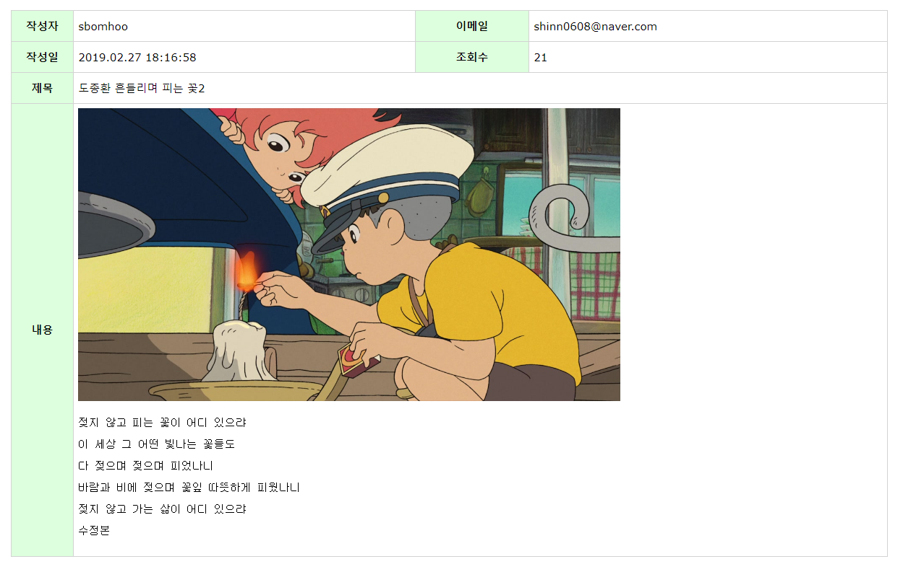  
- 사진이 추가 / 제목 변경 / 글 '수정본'이라는 글씨 생김  
  
  
**<날씨 페이지>**  
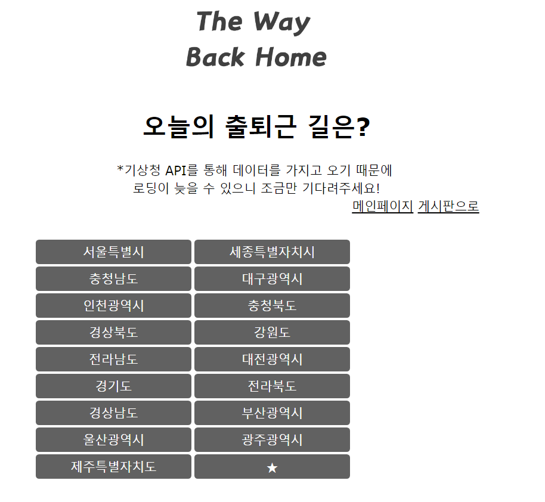  
- 각 지역 버튼을 누르기 전에 보이는 페이지  

**<날씨 페이지>**  
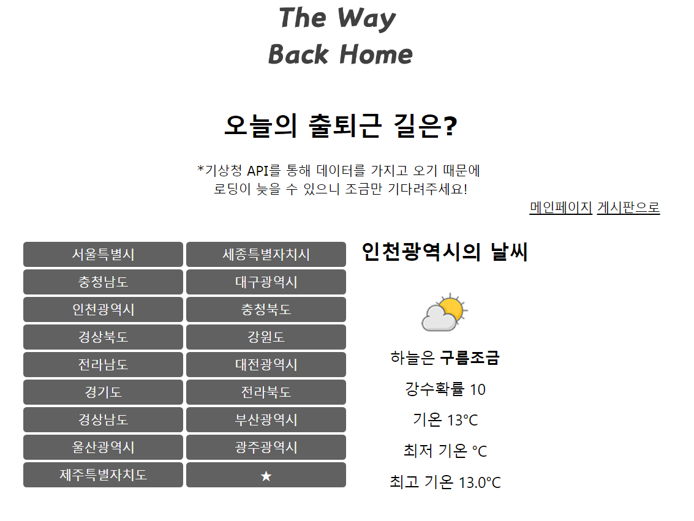  
- 버튼을 누르면 기상청 Open API로 부터 JSON형태로 데이터를 받아와
- json-simple 라이브러리로 파싱을 한다.
- 날씨에 맞게 아이콘이 나오게 하여 가독성을 높였다.
  
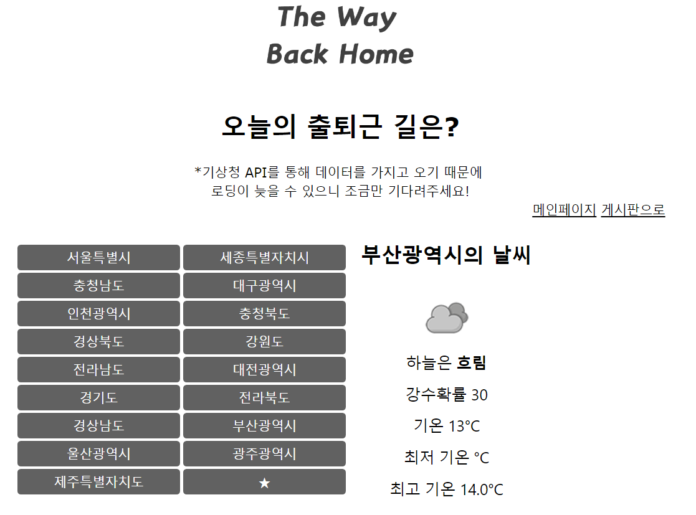  


***
개선하고 싶은 점
-------------
-  현재 날씨 부분에 세세한 주소까지 들어가지 않고 
-  시단위로 구현했는데, 사용자의 위치를 읽어 시,구,동 단위의 날씨를 받아오고 싶다.
  
 

***
기타(개발노트) _지우기 아까워서 
-------------
  
<파일 업로드 이슈>  
mvc model2  
-request로 파라미터를 가져오는 것은 서블릿, 인터페이스, 클래스 모두 공유가 된다.  
	(공유가 되야 커맨드가져와서 처리 클래스로 보내고 작업 처리)  
-하지만 multipartrequest는 모두 공유가 안됨,  
	따라서 커맨드 1번 가져올때 호출하고, 글 쓸 때 값 1번 호출 총 2번 호출해야함  
-그치만 multipartrequest는 2번 호출하면   
Corrupt form data: premature ending  에러가 뜬다.  
- 에러뜨는 이유: 두번째 호출될때 request에 inputStream이 사라져서 발생함.  
  
- 글을 쓸때만 multipartrequest를  쓰면 해결방법이 있지만 글 수정떄도 multipartrequest를 필요  

  
해결방안  
방법1. 글 쓸때만 multipartrequest 사용    
- 한 번 업로드하면 사진 수정할 수x   
- model2 형식 지킨다.  

  
방법2. mvc model2에서 글 쓰고,삭제만 커맨드 안받아오고 서블릿하나씩 만들어 직접 처리  
- 사진 업로드,수정 모두 가능할 듯   
- model2형식 깨진다.  
  
방법3. session을 이용해서 커맨드 받아주기!!  -> 채택  
  


<reply 이슈>  
- 너무 힘들었다.  
- 답글 구현 ㅇ   답글의 답글 x   
- 답글의 답글 못쓰게 boardView.jsp 에서 EL과 JSTL로 막아놨다.  
	(만약에 제목이 [Re]가 있으면 버튼 안보이게)  
-DB에 추가한 칼럼들  
 ref : 부모글 번호  (첫번쨰 정렬 기준 내림차순)  
 indent: 원글과 답변글 구분하기위한 들여쓰기용 (하지만 여기선 없어도 됨)  
 step : 같은 부모글에 여러개의 답글 달렸을 경우 순서를 정하기 위해 만듬  
	board_seq.nextval을 값으로 넣음, 고유하게 1씩 증가하는(두번째 정렬 기준 오름차순)  
	

  

<로그인과 게시판 합치기 이슈>  
0. 로그인 후-> 메인, 게시판 접근 가능  
  
1. 세션 저장  
//LoginServlet.java  
MemberVO login_user_info = mDao.getMember(userid);  
session.setAttribute("loginUser", login_user_info); 
=> 로그인 멤버VO자체를 세션으로 저장  
  
2-1. jsp에서 세션 사용하기   
<c:if test="${empty loginUser}">  
	<jsp:forward page='login.do' />  
</c:if>  
=> 세션 없을 시 모든 페이지에서 login.do로 가게 만듦  
  
2-2. jsp에서 세션 사용하기   
${loginUser.userid}   
- JSP에서 EL로 세션 불러내어 사용  
 
  
3. boardWrite.jsp, boardReply.jsp 수정할것  
- 작성자 => 세션에 저장된 아이디로 바꾸기  
- 비밀번호 => 폼에서 없애기 ,db에도 없애기  
- 이메일 => 세션에 저장된 유저의 이메일 적기  
  
4. boardView.jsp 수정할것  
- 글 수정, 글 삭제 버튼 세션id와 글쓴이id가 같으면 보이게 아니면 안보이게  
- 글 삭제 눌렀을때 패스워드 체크하는 로직 모두 삭제   
  
5. boardUpdate.jsp 수정할것  
- 패스워드 삭제 -> action,dao 고치기  

  
